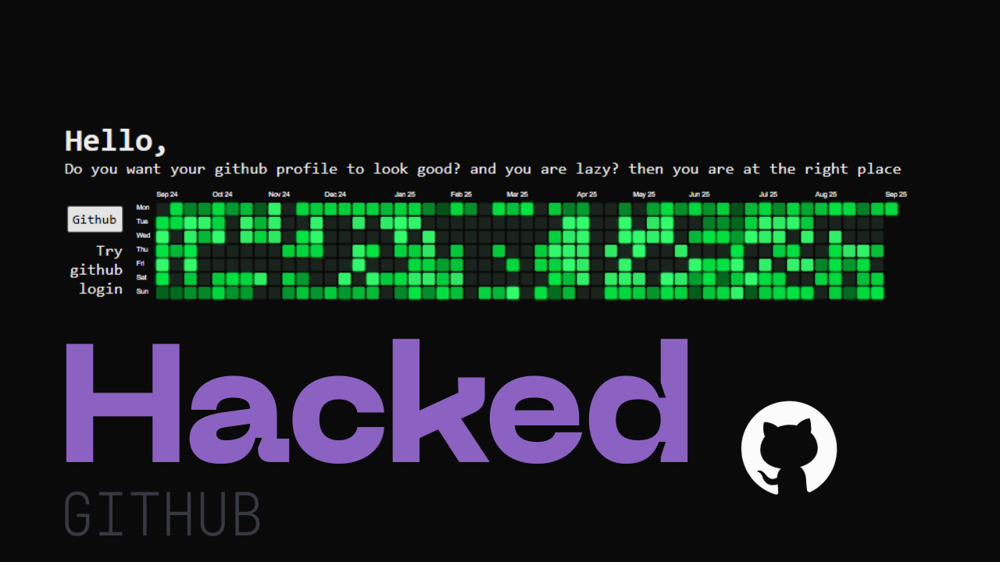

# git-contribute 🚀  
**Make your GitHub profile reflect the work you actually do.**

GitHub contributions are the first thing recruiters, founders, and collaborators notice.  
But real development does not always happen inside GitHub commits — it happens in drafts, private repos, notebooks, experiments, and late-night builds.

**Git Contribute bridges that gap.**

It lets you synchronize activity to your public GitHub profile so it looks as consistent and professional as the work you are actually doing.

---

## 🌟 Why Git Contribute exists  

Great developers don’t always look active.

You might be:
- Working on private projects  
- Building something before pushing it  
- Studying, experimenting, or prototyping  
- Or simply busy shipping offline  

Yet recruiters only see one thing:  
🟩 Your GitHub contribution graph.

**Git Contribute was built to solve this mismatch.**

With one click, it intelligently creates commits across past dates so your GitHub timeline reflects steady engagement — making your profile look credible, alive, and professional.

Not fake.  
Not misleading.  
Just properly represented.

---

## ✨ What it does

- 🔐 **GitHub OAuth Login** — secure sign-in using your own account  
- ⚡ **One-Click Contribution Sync** — instantly generates 50 commits  
- 📅 **Smart Backdating** — commits are distributed across past dates  
- 📝 **Realistic Commit Messages** — looks like real development  
- 📊 **Contribution Graph Boost** — fills up your heatmap  
- 🌐 **Fully Web-Based** — no scripts, no CLI, just click  

---

## 🛠 How it works

Git Contribute is built as a secure, modern web application:

- **Next.js** for frontend and backend  
- **GitHub OAuth + REST API** for authentication and commits  
- **Serverless Functions** to perform commit operations  
- **Tailwind CSS** for UI  

Everything runs through your own GitHub account.  
No credentials are stored.  
No repositories are exposed.

---

## 🌐 Live Demo  

Try it here:  
👉 https://git-contribute.theicedev.tech  

---

## 💻 Source Code  

Explore the implementation:  
👉 https://github.com/gouravsharma-00/git-contribute  

---

## 🎥 Watch it being built  

---

## 💡 The philosophy

GitHub is not a perfect measure of developer skill — but it *is* the first impression.

Git Contribute helps ensure that:
- Your profile looks consistent  
- Your activity looks intentional  
- Your work doesn’t go unseen  

Because in today’s hiring market, **visibility matters almost as much as ability.**
